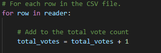

# Election Analysis

## Overview of Election Audit

We have been enlisted by the board of elections to help automate their election audit processes by using a congessional precinct as a means of a test. Should the test go well, then the analysis used now will used in other districts and eventually in local elections. We will make code that imports data, runs through it will counting and separating the data to then calculate totals and declare the winner. 

## Results

  This is the data obtained from the audit:

  - The total amount of votes is 369,711, found by counting the rows in the data provided using the following code:
  
  
  
  - The votes broken down by county are as follows: 

  
  - The county with the largest voter turnout is Denver county. While the code prints the analysis data to the terminal and text file, it allow determines the largest amount of votes by cross-examining the saved largest vote number with the currently loaded county to find the which one is larger.
  

  - The votes broken down by candidate are as follows:
  

  - Diana DeGette is the winning candidate, receiving 272,892 votes which is 73.8% of the voting populace.

## Election Audit Summary

We have completed the objectives of both automating the process of the audit and providing the winner of the election using our code. I believe that this code could be using other audit as only come tweaks would be necessary. As long as the csvs are provided, a for loop could be added at the start of the document to run through multiple datasets for multiple districts. Another idea for this concept would be instead to use an input statement at the start of the code to enter the filename of the data to analyze so the data file wouldn't have to be renamed before running the program.
